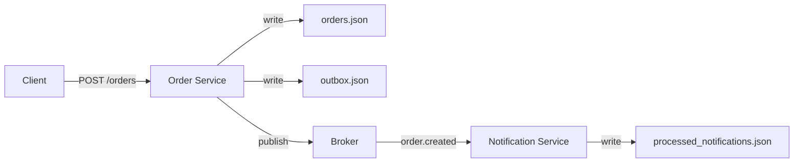

# System Design Document

## English Version

### 1. Overview and Goals

**Problem:** Implement a small event-driven pipeline so that orders accepted by an HTTP service are reliably delivered to a notification consumer. The system must be durable (no lost events), idempotent (no duplicate side-effects), and simple to run locally for the assessment.

**Primary goals / success criteria**

- Correct REST behavior for creating orders.
- Durable event persistence (transactional outbox).
- At-least-once delivery to Notification Service and consumer idempotency.
- Tests that cover validation, idempotency, and basic integration.

**Non-goals**

- Full production-grade broker (Kafka/RabbitMQ) implementation.
- Authentication/authorization, rate limiting, multi-tenancy.
- High throughput tuning (this is a small assessment demo).

---

### 2. Architecture Overview

High-level components:

- `Order Service` (HTTP)
- `Broker` (in-process EventEmitter for the assessment)
- `Notification Service` (consumer)
- Persistent stores: `services/orders/data/orders.json`, `services/orders/data/outbox.json`, `services/notifications/data/processed_notifications.json`

Diagram (Mermaid):



---

### 3. Components

**Order Service**

- Accept orders, validate input, reject duplicate `orderId` and duplicate `itemId` across all orders.
- Persist orders in `orders.json` and append events to `outbox.json`.
- Publish `order.created` events to broker.

**Notification Service**

- Subscribe to `order.created` events.
- Process each `itemId` in an order.
- Maintain idempotency using `processed_notifications.json` to avoid duplicates.

**Broker**

- In-process `EventEmitter`.
- Topic: `order.created`.
- Transient (no persistence); durability guaranteed by outbox file.

---

### 4. Interfaces and Contracts

**REST API**

- `POST /orders`
  - Request:
    ```json
    { "itemId": ["itemA", "itemB"], "orderId": "optional" }
    ```
  - Responses:
    - `202 Accepted`: `{ "orderId": "<uuid>" }`
    - `400 Bad Request`: `{ "error": "itemId is required (non-empty array)" }`
    - `409 Conflict`: `{ "error": "duplicate orderId" }` or `{ "error": "duplicate item(s): ..." }`

**Event schema (`order.created`)**

```json
{
  "type": "order.created",
  "version": 1,
  "orderId": "...",
  "itemId": ["..."],
  "createdAt": "ISO8601"
}
```

---

### 5. Sequence and Data Flow

1. Client sends POST `/orders`.
2. Order Service validates input, persists order, appends to outbox, publishes to broker.
3. Notification Service consumes `order.created`, processes each item, and records processed keys.

**Example success log**

```
📦 Order service listening on 8080 (mode=broker+file)
🔔 notification.sent orderId=123 itemId=itemA
🔔 notification.sent orderId=123 itemId=itemB
```

**If broker is down**

- Order is saved in `orders.json`
- Event is appended to `outbox.json`
- Notification Service misses event realtime
- Replay from outbox can restore consistency

---

### 6. Reliability and Fault Tolerance

- **Idempotency**:
  - Order Service rejects duplicate `orderId` and duplicate `itemId`.
  - Notification Service ensures each `orderId::itemId` is processed once.
- **Broker outage**: Outbox ensures durability; replay needed for recovery.
- **Retry/DLQ**: Not implemented here, but recommended in production.

---

### 7. Scalability and Performance

- File-based storage is not scalable; replace with a database (Postgres/Redis).
- Replace EventEmitter with Kafka/RabbitMQ for distributed scaling and partitions.
- Notification Service can be scaled horizontally using consumer groups.

---

### 8. Security and Compliance

- Config/secrets managed via environment variables.
- No auth for assessment; add TLS and JWT auth in production.
- Input validation prevents injection.

---

### 9. Observability

- Logging to stdout for orders and notifications.
- Metrics to add in production:
  - `orders_received_total`, `events_published_total`, `notifications_sent_total`, `outbox_size`.
- Alerts for broker unavailability, outbox growth, consumer failures.

---

### 10. Deployment and Operations

- **Local**: `npm install && npm start`
- **Production**: containerize services, deploy with Docker/Kubernetes, use managed broker (Kafka/Redis).

---

### 11. Trade-offs and Alternatives

- **Chosen**: file persistence + EventEmitter.
- **Pros**: simple, easy for local assessment, durable via outbox.
- **Cons**: not scalable, not distributed.
- **Alternative**: Kafka + relational DB.

---

### 12. Risks and Mitigations

- File corruption → use DB.
- Duplicate notifications → solved by idempotency.
- Outbox growth → replay jobs and archiving.

---

### 13. Future Work

- Replace file stores with database.
- Replace EventEmitter with real broker (Kafka/Redis).
- Add metrics, tracing, monitoring, and authentication.

---

## Indonesian Version

### 1. Gambaran Umum dan Tujuan

**Masalah:** Membangun pipeline event-driven kecil agar order yang diterima lewat HTTP dapat dikirim dengan andal ke consumer notifikasi. Sistem harus tahan kehilangan event (durable), idempoten (tidak menghasilkan duplikasi), dan mudah dijalankan lokal.

**Tujuan utama**

- REST API order berfungsi benar.
- Persistensi event yang tahan (transactional outbox).
- Delivery minimal sekali (at-least-once) dengan idempotensi di consumer.
- Tes meliputi validasi, idempotensi, dan integrasi dasar.

**Bukan tujuan**

- Broker produksi (Kafka/RabbitMQ).
- AuthN/AuthZ, rate limiting, multi-tenant.
- Tuning throughput besar.

---

### 2. Arsitektur

Komponen utama:

- `Order Service` (HTTP)
- `Broker` (EventEmitter in-process)
- `Notification Service` (consumer)
- Store persisten: `orders.json`, `outbox.json`, `processed_notifications.json`

Diagram (Mermaid):


---

### 3. Komponen

**Order Service**

- Terima order, validasi, tolak `orderId` dan `itemId` duplikat.
- Simpan order ke `orders.json`, tulis event ke `outbox.json`.
- Publish event `order.created`.

**Notification Service**

- Subscribe ke event `order.created`.
- Proses tiap `itemId` dan simpan idempotensi ke `processed_notifications.json`.

**Broker**

- EventEmitter in-process, topik `order.created`, tanpa persistence.

---

### 4. API dan Kontrak

**REST API**

- `POST /orders`
  - Request:
    ```json
    { "itemId": ["itemA", "itemB"], "orderId": "optional" }
    ```
  - Response:
    - `202 Accepted`: `{ "orderId": "..." }`
    - `400`: `{ "error": "itemId is required" }`
    - `409`: `{ "error": "duplicate orderId" }` atau `{ "error": "duplicate item(s)" }`

**Skema Event**

```json
{
  "type": "order.created",
  "version": 1,
  "orderId": "...",
  "itemId": ["..."],
  "createdAt": "ISO8601"
}
```

---

### 5. Urutan Alur Data

1. Client → POST `/orders`.
2. Order Service validasi → simpan order → tulis outbox → publish broker.
3. Notification Service konsumsi event → proses tiap item → simpan kunci idempoten.

---

### 6. Keandalan dan Fault Tolerance

- Idempotensi lewat validasi `orderId` dan `itemId`.
- Consumer idempoten via `processed_notifications.json`.
- Broker mati → event tetap aman di `outbox.json`.

---

### 7. Skalabilitas dan Performa

- File store tidak scalable → gunakan database.
- Ganti broker EventEmitter dengan Kafka/RabbitMQ untuk distribusi.

---

### 8. Keamanan

- Secrets di environment.
- Assessment tanpa auth; produksi tambahkan TLS + JWT.

---

### 9. Observabilitas

- Logging ke stdout.
- Tambahkan metrics (`orders_total`, `outbox_size`) di produksi.
- Alert untuk broker mati, outbox menumpuk, error konsumer.

---

### 10. Deployment dan Operasi

- Lokal: `npm install && npm start`
- Produksi: container + Kubernetes, broker terkelola (Kafka/Redis).

---

### 11. Trade-off

- Pilihan: file + EventEmitter (sederhana, demo cepat).
- Alternatif: DB + Kafka (produksi).

---

### 12. Risiko dan Mitigasi

- File corruption → gunakan DB.
- Duplikat notifikasi → idempotensi.
- Outbox membengkak → replay dan archive.

---

### 13. Pekerjaan Mendatang

- Migrasi ke DB.
- Ganti EventEmitter dengan Kafka/Redis.
- Tambah observabilitas dan keamanan.
